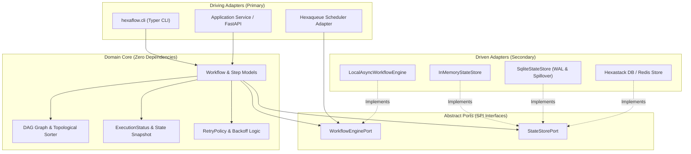
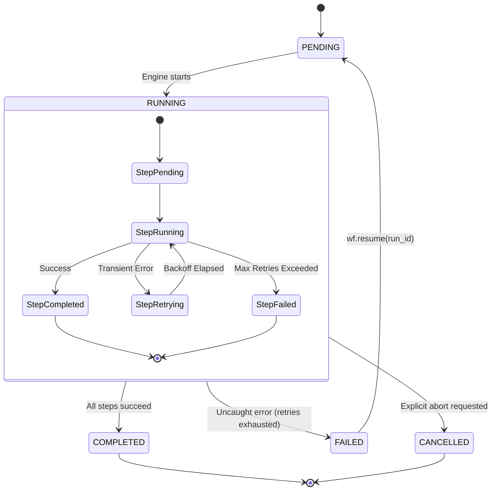
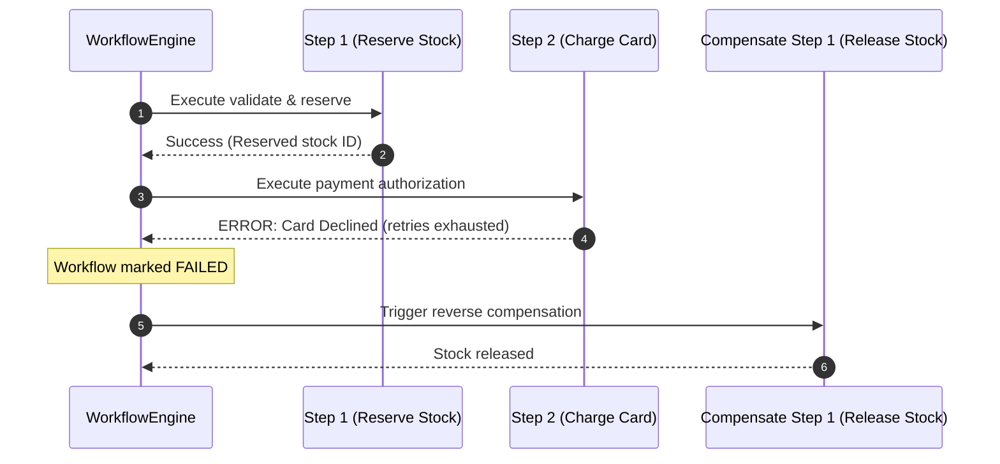

# 🏛️ Hexaflow Architecture & Design

> **Architectural Intent**: Hexaflow follows strict Hexagonal Architecture (Ports and Adapters). It separates the pure DAG domain and state machine from execution engines and storage implementations.

---

## 1. Hexagonal Layers & Boundaries

The codebase is organized into concentric layers with strict inward dependency flow:



### Layer Responsibilities

1. **Domain (`hexaflow.domain`)**:
   - Pure Python dataclasses and Pydantic models.
   - Contains no database drivers, no async runtimes, and no subprocess logic.
   - Defines `Workflow`, `Step`, `Stage`, `ExecutionStatus`, `StepCheckpoint`, and `RetryPolicy`.

2. **Ports (`hexaflow.ports`)**:
   - `WorkflowEnginePort`: Defines the execution contract (`execute(workflow, run_id, store) -> WorkflowStateSnapshot`).
   - `StateStorePort`: Defines persistence contracts (`save_checkpoint()`, `load_state()`, `list_runs()`).

3. **Adapters (`hexaflow.adapters`)**:
   - `adapters.engines.local_async`: High-performance asynchronous execution engine utilizing `asyncio` task groups and topological scheduling.
   - `adapters.storage.in_memory`: Ephemeral in-memory dictionary store for zero-I/O unit tests.
   - `adapters.storage.sqlite`: Production-grade WAL-mode SQLite state store with local file spillover for intermediate outputs.

4. **DSL (`hexaflow.dsl`)**:
   - Declarative decorator API (`@wf.step`, `@wf.stage`, `@wf.split`, `@wf.join`, `@wf.compensate`) providing ergonomic workflow building blocks.

---

## 2. State Machine Lifecycle

Workflows and steps adhere to an explicit finite state machine:



### Execution Statuses

- **`PENDING`**: Workflow or step is registered and awaiting execution dependencies.
- **`RUNNING`**: Active execution in progress.
- **`COMPLETED`**: Execution finished successfully; outputs are persisted in state checkpoints.
- **`FAILED`**: Execution halted due to an exception that exceeded configured retry thresholds.
- **`CANCELLED`**: Execution was aborted via cancel signal.

---

## 3. The Zero-Daemon Invariant

### What Stays in Hexaflow
Hexaflow maintains an uncompromising guardrail: **It will never become an enterprise database suite or require background daemon processes.**
- Built-in storage is strictly limited to `InMemoryStateStore` and `SqliteStateStore`.
- All background execution is thread/process-local or native asyncio.

### Where Advanced Features Live
- **Relational Databases & Redis**: Enterprise PostgreSQL, MySQL, and distributed Redis state stores belong in [**`hexastack-flow`**](https://github.com/TheTrueSCU/hexastack) backed by `hexastack-db`.
- **Multi-Node Cluster Scheduling**: Distributed split/join barriers across remote HPC worker nodes belong in [**`hexaqueue`**](https://github.com/TheTrueSCU/hexaqueue).

---

## 4. Compensation Rollback Mechanics

When business processes cross transactional boundaries, Hexaflow supports compensation handlers that execute in reverse topological order upon downstream failure:



Declare compensations with `@wf.compensate`:

```python
@wf.step("reserve_inventory")
def reserve_inventory(ctx):
    return {"res_id": "r_101"}


@wf.compensate("reserve_inventory")
def release_inventory(ctx):
    res_id = ctx.inputs["reserve_inventory"]["res_id"]
    warehouse.cancel_reservation(res_id)
```
