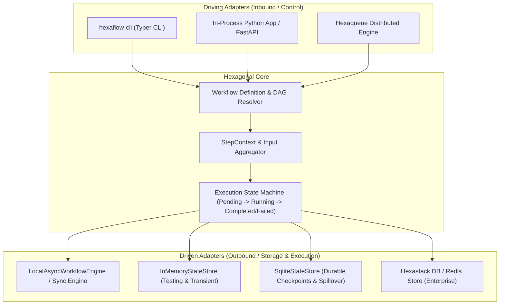

# Hexaflow

> **Lightweight, embeddable Python workflow engine with stages, steps, splits, joins, and checkpointed resumption.**

[](https://www.python.org/downloads/)
[](https://github.com/TheTrueSCU/hexaflow/blob/main/LICENSE)
[](architecture.md)
[](getting-started.md)

---

## 🌟 Why Hexaflow?

Most modern workflow orchestrators (Airflow, Temporal, Celery, Prefect) require running heavy external daemons, message brokers, and centralized database servers. When all you need is a deterministic, resumable, multi-step business process inside your service or application, that operational footprint is excessive.

**Hexaflow** provides high-reliability DAG execution directly in-process with **zero external daemons**:



---

## ⚡ Core Capabilities

- **🚀 Zero-Daemon Execution**: Runs entirely in-process using standard Python and Pydantic. No message queues, Redis brokers, or background daemons required.
- **💾 Crash-Resilient Checkpointing**: State is committed to SQLite or in-memory stores after each step. If your container crashes or restarts, call `wf.resume(run_id)` to pick up exactly where execution halted.
- **🔀 Concurrent Fan-Out & Join Barriers**: Split execution concurrently across independent steps and join results deterministically before advancing.
- **🔁 Transient Retries & Backoff**: Fine-grained retry policies with exponential backoff and jitter per step.
- **↩️ Compensation Rollbacks**: Declare reverse compensation handlers that run automatically if downstream steps fail.
- **🌐 Hexa Family Interoperability**: Embeds directly into [`hexastack-flow`](https://github.com/TheTrueSCU/hexastack) for enterprise database persistence, and scales to distributed clusters via [`hexaqueue`](https://github.com/TheTrueSCU/hexaqueue).

---

## 🚀 Quick Example

```python
from hexaflow import Workflow, RetryPolicy, StageExecutionMode

wf = Workflow(name="checkout_pipeline", version="1.0.0")


@wf.stage("cart")
@wf.step("validate_cart", retries=RetryPolicy(max_attempts=3))
def validate_cart(ctx) -> dict:
    return {"order_id": "ord_101", "total": 49.99}


@wf.stage("processing", execution_mode=StageExecutionMode.CONCURRENT_ALL)
@wf.step("charge_card", depends_on=["validate_cart"])
def charge_card(ctx) -> dict:
    order = ctx.inputs["validate_cart"]
    return {"status": "PAID", "auth": "ch_9942"}


@wf.stage("processing")
@wf.step("reserve_inventory", depends_on=["validate_cart"])
def reserve_inventory(ctx) -> dict:
    return {"status": "RESERVED", "warehouse": "US-WEST-2"}


@wf.stage("fulfillment")
@wf.step("ship_order", depends_on=["charge_card", "reserve_inventory"])
def ship_order(ctx) -> dict:
    return {"tracking": "TRK-100234"}


if __name__ == "__main__":
    result = wf.run()
    print(f"Status: {result.status.value} (Run ID: {result.run_id})")
```

---

## 📖 Explore the Documentation

- [Getting Started](getting-started.md) — Step-by-step setup, first workflow, checkpointing.
- [Architecture & Design](architecture.md) — Hexagonal layers, state store SPI, and state transitions.
- [API & DSL Reference](api-reference.md) — Decorators, execution modes, retry policies, and context.
- [Tutorial: Order Fulfillment Pipeline](tutorials/01-order-fulfillment-pipeline.md) — End-to-end runnable walkthrough.
