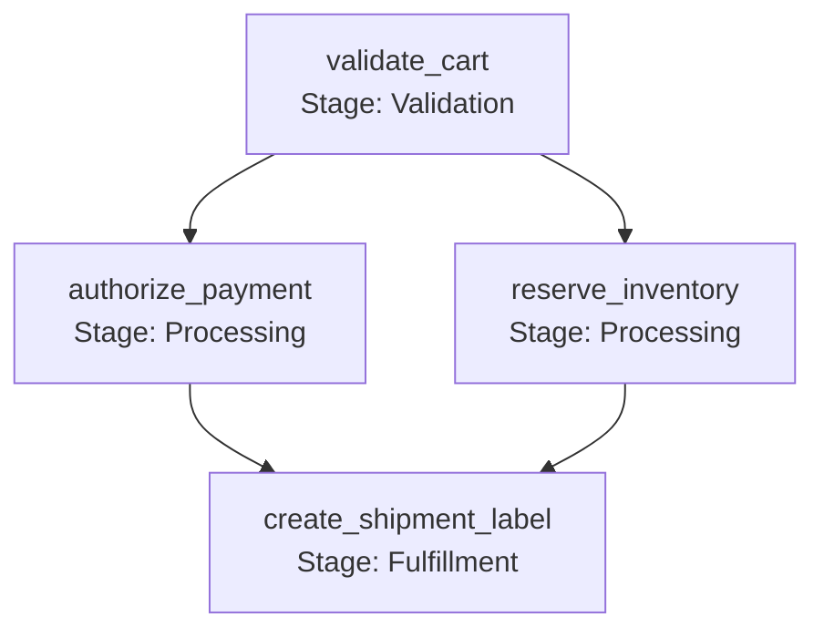

# Tutorial: Order Fulfillment Pipeline

This tutorial walks through implementing an e-commerce order fulfillment pipeline with validation, concurrent processing (fan-out), join barrier synchronization, and error handling.

---

## 🎯 What We're Building

An order processing pipeline consisting of three distinct stages:



1. **Stage 1 (Validation)**: Validates line items and totals sequentially.
2. **Stage 2 (Processing Split)**: Authorizes payment and reserves warehouse inventory **concurrently**.
3. **Stage 3 (Fulfillment Join)**: Issues courier shipping label only after **both** payment and inventory reservation complete.

---

## 🛠️ Complete Code

Create `order_pipeline.py`:

```python
"""Order Fulfillment Pipeline - Reference Hexaflow Workflow."""

from hexaflow import RetryPolicy, StageExecutionMode, Workflow

# 1. Initialize Workflow Definition
wf = Workflow(
    name="order_fulfillment",
    version="1.0.0",
    description="E-commerce checkout, payment processing, inventory reservation, and shipping.",
)


# 2. Stage 1: Validation
@wf.stage("validation", description="Validate cart items and pricing.")
@wf.step("validate_cart", retries=RetryPolicy(max_attempts=3))
def validate_cart(ctx) -> dict:
    """Validate cart contents and calculate order subtotal."""
    print("  [Step 1] Validating cart items...")
    return {
        "order_id": "ord_9901",
        "items": ["laptop", "docking_station"],
        "total_usd": 1850.00,
    }


# 3. Stage 2: Concurrent Processing (Fan-Out)
@wf.stage(
    "processing",
    execution_mode=StageExecutionMode.CONCURRENT_ALL,
    description="Parallel processing.",
)
@wf.step("authorize_payment", depends_on=["validate_cart"])
def authorize_payment(ctx) -> dict:
    """Authorize credit card payment."""
    cart = ctx.inputs["validate_cart"]
    print(f"  [Step 2A] Authorizing payment for ${cart['total_usd']}...")
    return {
        "transaction_id": "tx_auth_4412",
        "status": "APPROVED",
    }


@wf.stage("processing")
@wf.step("reserve_inventory", depends_on=["validate_cart"])
def reserve_inventory(ctx) -> dict:
    """Reserve inventory warehouse allocations."""
    cart = ctx.inputs["validate_cart"]
    print(f"  [Step 2B] Reserving stock for items: {cart['items']}...")
    return {
        "reservation_id": "res_wh_88",
        "warehouse": "US-EAST-1",
    }


# 4. Stage 3: Fulfillment (Join Barrier)
@wf.stage("fulfillment", description="Generate shipment label after payment and inventory.")
@wf.step("create_shipment_label", depends_on=["authorize_payment", "reserve_inventory"])
def create_shipment_label(ctx) -> dict:
    """Create courier shipping label requiring both payment and inventory confirmation."""
    payment = ctx.inputs["authorize_payment"]
    inventory = ctx.inputs["reserve_inventory"]

    print(
        f"  [Step 3] Issuing shipping label from {inventory['warehouse']} "
        f"(Payment: {payment['transaction_id']})..."
    )
    return {
        "tracking_number": "TRK-98127391823",
        "courier": "HexaExpress",
    }


if __name__ == "__main__":
    print(f"Executing workflow '{wf.name}'...")
    state = wf.run()
    print(f"\nWorkflow Status: {state.status.value} (Run ID: {state.run_id})")

    for step_name, chk in state.step_checkpoints.items():
        print(f"  - {step_name}: {chk.status.value} (took {chk.duration_seconds:.3f}s)")
```

---

## 🏃 Running the Tutorial

Run the script directly:

```bash
python order_pipeline.py
```

Console Output:

```text
Executing workflow 'order_fulfillment'...
  [Step 1] Validating cart items...
  [Step 2A] Authorizing payment for $1850.0...
  [Step 2B] Reserving stock for items: ['laptop', 'docking_station']...
  [Step 3] Issuing shipping label from US-EAST-1 (Payment: tx_auth_4412)...

Workflow Status: COMPLETED (Run ID: run_a194bc02)
  - validate_cart: COMPLETED (took 0.001s)
  - authorize_payment: COMPLETED (took 0.002s)
  - reserve_inventory: COMPLETED (took 0.002s)
  - create_shipment_label: COMPLETED (took 0.001s)
```

---

## 🔍 Key Architectural Takeaways

1. **Explicit Data Contracts**: Steps do not share global variables. Data flows cleanly via `ctx.inputs["step_name"]`.
2. **Deterministic Join Barriers**: The `create_shipment_label` step cannot execute until **both** `authorize_payment` and `reserve_inventory` have successfully written checkpoints.
3. **Resilience**: If the courier API in Step 3 fails, the cart validation, credit card authorization, and warehouse reservations remain safely persisted. Resuming the run only executes Step 3.
